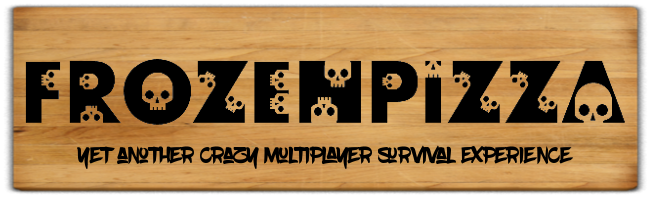

# README #

### Contributors ###

Thanks to the editors of Tiled, the map editor this project relies on.
Thanks to the author of TiledSharp, the map parser this project uses actively.
Thanks to the MonoGame project community and devs, as without them there would be nothing.

### What's coming (If you wait 'til 2030) ###
- Add keybinds
- Build inventory system (who knew)
- Fix loads of bugs. (no shit)
- Enable 'create server'
- Add scarecrow (wut?)

### How do I run the game? ###

This game requires MonoGame Framework installed.

It has been compiled and tested on Windows 10 x64 Pro, and MacOS X 10.11 El Capitan.
It should work on any MonoGame compatible platform. 

1. Clone the repository
2. Open FrozenPizza.sln
3. Compile & Run
4. ??????
5. Enjoy
